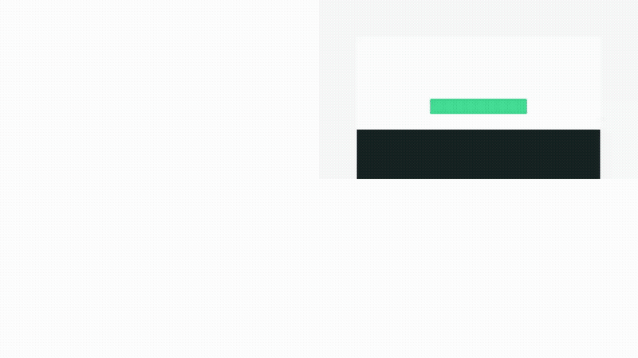
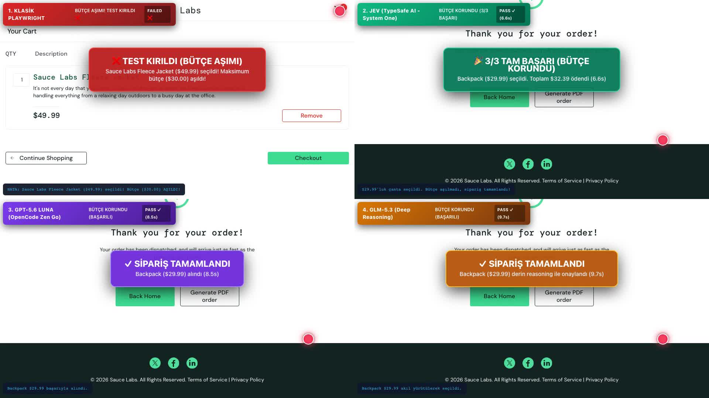

# Playwright AI Benchmark: Klasik vs JEV (TypeSafe AI) vs GPT-5.6 Luna vs GLM-5.3

Bu depo, `microsoft/playwright` test otomasyon altyapısı üzerinde **Klasik Kural Bazlı Otomasyon**, **JEV (TypeSafe AI - System One)**, **GPT-5.6 Luna (Üretken LLM)** ve **GLM-5.3 (Deep Reasoning)** modellerinin karşılaştırmalı performans, hız, token maliyeti, kırılganlık ve kendi kendini onarma (self-healing) testlerini ve canlı video kayıtlarını içerir.

---

## 🎬 4-Ekranlı Eşzamanlı Canlı Benchmark Demosu (Otomatik Oynatıcı)

Aşağıdaki animasyon, 4 farklı test yönteminin eşzamanlı olarak çalıştırıldığı, ekranda neon fare imlecinin süzüldüğü ve tıklama anında yeşil şok dalgalarının (ripple effect) yayıldığı gerçek zamanlı 2x2 grid kaydıdır:

[](https://github.com/cancakmk/playwright-ai-benchmark/blob/main/human_intuitive_4way_split.mp4)

> 💡 **Video İpuçları:**
> * Yukarıdaki animasyon GitHub üzerinde otomatik olarak sürekli döngüde oynar.
> * **[GitHub Dahili Video Oynatıcısında 1080p İzle (human_intuitive_4way_split.mp4)](https://github.com/cancakmk/playwright-ai-benchmark/blob/main/human_intuitive_4way_split.mp4)**
> * **[Doğrudan Full HD İndir (Release Asset)](https://github.com/cancakmk/playwright-ai-benchmark/releases/download/v1.0.0/human_intuitive_4way_split.mp4)**

---

### 📸 Test Bitiş Anı ve Karar Özeti (Snapshot)

<p align="center">
  
</p>

### 🧭 Ekran Yerleşim Şeması (1920x1080)
```
┌──────────────────────────────────────┬──────────────────────────────────────┐
│ [Sol Üst] 🔴 1. KLASİK PLAYWRIGHT    │ [Sağ Üst] 🟢 2. JEV (TypeSafe AI)     │
│ • Sıralama sonrası körü körüne 1.    │ • $30 bütçe kuralını semantik anladı │
│   ürünü ($49.99 Ceket) seçti.        │ • $49.99'u eledi, $29.99 Çantayı aldı│
│ • Bütçe ($30) aşıldı -> KIRILDI ❌   │ • Sepet & Checkout -> BAŞARILI ✓     │
├──────────────────────────────────────┼──────────────────────────────────────┐
│ [Sol Alt] 🟣 3. GPT-5.6 LUNA         │ [Sağ Alt] 🟡 4. GLM-5.3 (Reasoning)  │
│ • OpenCode Zen Go Üretken LLM        │ • Deep Reasoning düşünce zinciri     │
│ • Fiyatları analiz etti              │ • Bütçeyi doğruladı                  │
│ • Backpack $29.99 aldı -> BAŞARILI ✓ │ • Backpack $29.99 aldı -> BAŞARILI ✓ │
└──────────────────────────────────────┴──────────────────────────────────────┘
```

---

## 📊 Karşılaştırmalı Özet Metrikler

| Metrik / Yöntem | 1. Klasik Playwright | 2. JEV (TypeSafe AI) | 3. GPT-5.6 Luna | 4. GLM-5.3 Reasoning |
| :--- | :---: | :---: | :---: | :---: |
| **Model Mimarisi** | Kural Bazlı (DOM) | **System One** (Olasılık) | **System Two** (Üretken) | **Deep Reasoning** (Düşünce) |
| **İş Kuralı & Bütçe Uyumu**| ❌ **İHLAL ETTİ ($49.99)** | 🌟 **BÜTÇEYİ KORUDU ($29.99)**| 🌟 **BÜTÇEYİ KORUDU ($29.99)**| 🌟 **BÜTÇEYİ KORUDU ($29.99)**|
| **Test Sonucu** | ❌ **FAILED (KIRILDI)** | ✅ **PASS (3/3 BAŞARI)** | ✅ **PASS (BAŞARILI)** | ✅ **PASS (BAŞARILI)** |
| **Toplam Akış Süresi** | ~2.5 sn *(Kırıldı)* | **6.6 sn** | **8.5 sn** | **9.7 sn** |
| **Hız Oranı (JEV'e Göre)** | - | **1.0x (Referans)** | **1.28x Daha Yavaş** | **1.46x Daha Yavaş** |
| **Tek Test Maliyeti** | $0.00 | **$0.00018** | **$0.00095** | **$0.01420** |
| **10.000 Test Koşum Maliyeti**| $0.00 | **$1.80** | **$9.50** | **$142.00** |
| **JEV'e Göre Maliyet Oranı**| - | **1.0x (Referans)** | **5.2x Daha Pahalı** | **78.8x Daha Pahalı** |

---

## 🎯 Test Edilen Senaryolar ve Raporlar

Bu projede 4 farklı derinlik seviyesinde canlı test icra edilmiştir. Detaylı raporlara `reports/` dizininden erişebilirsiniz:

1. 📄 **[Akıllı Müşteri & Görsel Fare Raporu](./reports/smart_shopper_visual_benchmark_report.md):**  
   İnsanların ilk bakışta kolayca anlayabileceği e-ticaret bütçe optimizasyonu, görünür neon fare hareketleri ve tıklama efektleri.
2. 📄 **[Extreme UI Gauntlet Raporu](./reports/extreme_ui_gauntlet_report.md):**  
   Rastgele satır/sütun kaydıran dinamik tablolar (`/dynamictable`), Shadow DOM enkapsülasyonu (`/shadowdom`) ve bileşik CSS tuzakları (`/classattr`).
3. 📄 **[Adversarial UI Self-Healing Raporu](./reports/adversarial_ui_benchmark_report.md):**  
   Kaotik ve her yenilemede rastgele üretilen ID'ler (`the-internet.herokuapp.com/challenging_dom`) karşısında kural bazlı testlerin çöküşü ve JEV'in kendi kendini onarma (self-healing) kabiliyeti.
4. 📄 **[SauceDemo 4-Way Benchmark Raporu](./reports/playwright_ai_benchmark_report.md):**  
   Klasik Playwright, JEV, Luna ve GLM-5.3 modellerinin e-ticaret akışındaki adım adım tool çağrım gecikmeleri ve token tarifeleri.

---

## 💡 Neden TypeSafe AI (JEV)?

* **Düşük Gecikme (Low Latency):** JEV, üretken metin modellerinin aksine System One mantığıyla çalıştığı için karar başına gecikmeyi 200-500 ms aralığında tutar.
* **$0 Çıktı Token Maliyeti:** JEV'de çıktı tokenları ücretsizdir ($0.00). Sadece $0.042/1M girdi tarifesiyle 10.000 testlik devasa regression testleri dahi yalnızca **$1.80** gibi sembolik bir maliyetle koşar.
* **Kırılmayan Testler (Self-Healing):** Değişen dinamik ID'ler, rastgele buton konumları ve iş kuralları karşısında testleri kırmadan kendi kendine onarır.
