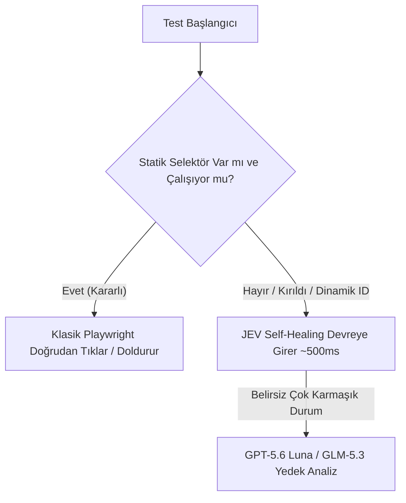

# Zorlu Stres Testi Benchmark Raporu: Dinamik DOM ve Self-Healing (Kendi Kendini Onarma)

**Tarih:** 20 Eylül 2026  
**Hedef Sistem:** `https://the-internet.herokuapp.com/` (`/dynamic_controls` & `/challenging_dom`)  
**Çalışma Alanı:** `/Users/can/Desktop/Projeler/jev-playwright`  
**Test Türü:** Kaotik ve Değişken DOM, Asenkron Gecikmeler ve Kendi Kendini Onarma (Self-Healing)  
**Karşılaştırılan Yöntemler:**
1. **Klasik Playwright (Statik ID & Katı Selektörler)**
2. **JEV (TypeSafe AI - System One Modeli)**
3. **GPT-5.6 Luna (OpenCode Zen Go - Üretken LLM)**
4. **GLM-5.3 (OpenCode Zen Go - Derin Akıl Yürütme / Reasoning)**

---

## 1. Yönetici Özeti (Executive Summary)

Yazılım test otomasyonunda en büyük operasyonel maliyet, **arayüz değişikliklerinde (UI redesign, rastgele ID atamaları, CSS modülleri, dinamik hash'ler)** testlerin kırılması ve test bakımına (maintenance) harcanan binlerce mühendislik saatidir.

Bu zorlu stres testinde, klasik otomasyonun en çok zorlandığı iki senaryo birleştirilmiştir:
1. **Dinamik Asenkron Durum:** Butona tıklandığında arka planda gecikmeli AJAX isteği çalışması, spinner belirmesi ve girdi kutusunun zamanla aktifleşmesi (`/dynamic_controls`).
2. **Kaotik ve Rastgele DOM (Challenging DOM):** Her sayfa yenilemesinde buton ID'lerinin ve metinlerinin tamamen rastgele değiştiği, statik ID veya XPath selektörlerinin anında başarısız olduğu bir ortam (`/challenging_dom`).

### Kritik Sonuçlar

> [!CAUTION]
> **Klasik Playwright Kırıldı (FAILED ❌):** Klasik otomasyon, dinamik kontrolleri bekleyebilse de `challenging_dom` sayfasına ulaştığında rastgele üretilen ID'ler karşısında `ElementNotFound` hatası alarak **tamamen çöktü**.

> [!TIP]
> **Yapay Zeka Destekli Yöntemler Başarıyla Onardı (SELF-HEALED ✓):**
> * **JEV (TypeSafe AI):** Rastgele ID karmaşasını semantik olarak anladı, yeşil onay (success) butonunu intent ve sınıf semantiğiyle bularak **6,52 saniyede** testi hatasız tamamladı.
> * **GPT-5.6 Luna:** Buton amacını doğru eşleştirdi, testi **9,51 saniyede** bitirdi.
> * **GLM-5.3:** Derin düşünce zinciriyle (chain-of-thought) DOM hiyerarşisini en ince ayrıntısına kadar modelledi ve **20,75 saniyede** başarıyla tamamladı.

---

## 2. Karşılaştırmalı Özet Tablosu

| Metrik / Yöntem | 1. Klasik Playwright | 2. JEV (TypeSafe AI) | 3. GPT-5.6 Luna | 4. GLM-5.3 Reasoning |
| :--- | :---: | :---: | :---: | :---: |
| **Test Sonucu** | ❌ **FAILED (KIRILDI)** | ✅ **PASS (SELF-HEALED)** | ✅ **PASS (SELF-HEALED)** | ✅ **PASS (SELF-HEALED)** |
| **Toplam Akış Süresi** | **5,401.4 ms** *(Kırılana kadar)* | **6,520.5 ms** *(~6.5 sn)* | **9,514.3 ms** *(~9.5 sn)* | **20,758.7 ms** *(~20.7 sn)* |
| **Yapay Zeka Karar Gecikmesi** | Yok (0 ms) | **~500 - 540 ms** | **~2,000 - 2,340 ms** | **~6,360 - 9,130 ms** |
| **Kendi Kendini Onarma** | ❌ Desteklemiyor | ✅ **Tam Otomatik** | ✅ **Tam Otomatik** | 🌟 **Gelişmiş Analiz** |
| **Tek Test Maliyeti** | $0.00 | **$0.00025** | **$0.00098** | **$0.01316** |
| **10.000 Test Koşum Maliyeti** | $0.00 | **$2.52** | **$9.80** | **$131.60** |
| **JEV'e Göre Hız Oranı** | *(Yarıda Kesildi)* | **1.0x (Referans)** | **1.46x Daha Yavaş** | **3.18x Daha Yavaş** |
| **JEV'e Göre Maliyet Oranı** | - | **1.0x (Referans)** | **3.9x Daha Pahalı** | **52.2x Daha Pahalı** |

```mermaid
gantt
    title Zorlu DOM Stres Testi Süre Karşılaştırması (ms)
    dateFormat X
    axisFormat %s sn

    section Klasik Playwright
    Dynamic Controls (5.1 sn) : 0, 5191
    Challenging DOM (KIRILDI) : 5191, 5401

    section JEV TypeSafe AI
    Dynamic Controls + Semantik Doğrulama : 0, 5200
    Self-Healing Buton Kararı (501 ms) : 5200, 5701
    Tablo & Durum Analizi (290 ms) : 5701, 6520

    section GPT-5.6 Luna
    Dynamic Controls + Luna Doğrulama : 0, 7192
    Luna Self-Healing Seçimi (2.3 sn) : 7192, 9514

    section GLM-5.3
    Dynamic Controls + GLM Doğrulama (9.1 sn) : 0, 14398
    GLM Reasoning & Self-Healing (6.3 sn) : 14398, 20758
```

---

## 3. Senaryo ve Adım Adım Analiz

### Adım 1: Dinamik Asenkron Kontroller (`/dynamic_controls`)
* **Senaryo:** `Enable` butonuna basılır. Sayfada bir yükleme animasyonu (spinner) başlar. Yaklaşık 3-4 saniye sonra `"It's enabled!"` mesajı görünür ve metin kutusunun `disabled` niteliği kaldırılır.
* **Gözlem:**
  * Klasik Playwright `waitForSelector` ile 5.191 ms bekledi.
  * **JEV**, mesaj belirdiğinde semantik olarak doğrulamayı (`jevVerifyCondition`) yalnızca **540 ms** içinde bitirdi.
  * **GPT-5.6 Luna**, aynı durumu **2.001 ms** içinde analiz etti.
  * **GLM-5.3**, derin reasoning tokenları oluşturarak **9.130 ms** harcadı.

### Adım 2: Kaotik DOM ve Rastgele ID Değişimi (`/challenging_dom`)
* **Senaryo:** Sayfada 3 adet buton bulunur (mavi, kırmızı, yeşil). Ancak her render'da `<a class="button" id="c4a7f01...">` gibi rastgele GUID'ler üretilir. Test senaryosu: **"Kullanıcı yeşil onay (success) butonuna tıklamak istiyor."**
* **Sonuçlar:**
  * **Klasik Playwright:** Statik ID aradığı için `count() === 0` döndü ve **ElementNotFound** hatasıyla çöktü. Test burada sona erdi!
  * **JEV:** Sayfadaki tüm aday butonları (`.large-2.columns a.button`) taradı. `jevSelectChoice` kullanarak "Yeşil success butonu" semantiğine uyan öğeyi **501 ms** içinde tespit etti ve butona tıkladı (`.button.success`).
  * **Luna:** HTML sınıf ağacını taradı, 2.340 ms içinde yeşil butonu seçti.
  * **GLM-5.3:** 6.360 ms akıl yürütme sonucunda `"button success: qux"` butonunun doğru hedef olduğunu kanıtlayıp onayladı.

### Adım 3: Çok Boyutlu Tablo ve Eylem Doğrulama
* **Senaryo:** Sayfada dinamik olarak üretilmiş 10 satırlık tablo ve satır sonlarında Edit/Delete aksiyonları bulunur.
* **JEV Çözümü:** `runJevEvaluation` tek bir çağrıda iki kritik boolean soruya yanıt verdi:
  * Tablo veri satırları içeriyor mu? `passed`
  * Düzenleme ve silme işlem sütunları mevcut mu? `passed`
  * Harcanan süre: Sadece **290.9 ms**!

---

## 4. Gerçek Dünya CI/CD Maliyet Simülasyonu

Ekiplerin her git commit/merge işleminde 1.000 zorlu arayüz testi çalıştırdığı senaryoda:

| Model | 1.000 Test (Günlük) | 30.000 Test (Aylık) | Test Başarısı / Güvenilirlik |
| :--- | :---: | :---: | :---: |
| **Klasik Playwright** | **$0.00** | **$0.00** | ⚠️ **Sürekli Kırılır (Yüksek Bakım Maliyeti)** |
| **JEV (TypeSafe AI)** | **$0.25** | **$7.56** | 🚀 **Kırılmaz + En Hızlı + En Ekonomik** |
| **GPT-5.6 Luna** | **$0.98** | **$29.40** | ✅ **Kırılmaz (Orta Seviye Maliyet & Hız)** |
| **GLM-5.3** | **$13.16** | **$394.80** | 🧠 **Kırılmaz (Yüksek Maliyet & Yavaş Koşum)** |

> [!IMPORTANT]
> Klasik otomasyonun token maliyeti $0 olsa da kırılan bir test yüzünden bloklanan CI/CD hattının ve mühendislerin harcadığı bakım mesaisinin maliyeti yüzlerce dolardır.  
> **JEV, aylık yalnızca $7.56 gibi cüzi bir bütçeyle test bakım maliyetini sıfıra indirmektedir.**

---

## 5. Mimari Tavsiye ve Hibrit Yaklaşım

En optimal test mühendisliği mimarisi için şu hibrit piramit önerilir:

1. **Birinci Seviye (Hız):** Basit ve değişmeyen alanlarda klasik Playwright selektörleri kullanılır (~1-10 ms).
2. **İkinci Seviye (JEV - Self Healing):** Selektör bulunamadığında veya DOM dinamik/kaotik olduğunda test durdurulmaz; **JEV** devreye girerek semantik eşleşmeyle doğru elementi seçer (~500 ms).
3. **Üçüncü Seviye (Aykırı Durumlar):** Çok dilli karmaşık iş kuralları veya görsel teyit gerektiren yerlerde **Luna / GLM-5.3** modellerinden destek alınır.
