# Extreme UI Test Gauntlet: 3-Aşamalı İleri Düzey Otomasyon Benchmark Raporu

**Tarih:** 20 Eylül 2026  
**Test Sahası:** `http://uitestingplayground.com/` (UI Test Automation Playground)  
**Çalışma Alanı:** `/Users/can/Desktop/Projeler/jev-playwright`  
**Test Sınıfı:** Aşırı Zorlu / Adversarial Test Ortamı  
**Test Edilen Modeller ve Sistemler:**
1. **Klasik Playwright (Kural ve Statik Selektör Bazlı)**
2. **JEV (TypeSafe AI - System One Modeli)**
3. **GPT-5.6 Luna (OpenCode Zen Go - Üretken LLM)**
4. **GLM-5.3 (OpenCode Zen Go - Deep Reasoning / Akıl Yürütme)**

---

## 1. Yönetici Özeti (Executive Summary)

Test otomasyonunda gerçek zorluklar e-ticaret sayfalarındaki basit buton tıklamaları değil; **rastgele değişen veri matrisleri, tarayıcı güvenlik ve gölge sınırları (Shadow DOM)** ve **bileşik sınıflarla tuzaklanmış DOM yapılarıdır**.

Bu çalışmada, test mühendisliğinin en zorlu uç durumlarını modelleyen **UI Test Automation Playground** üzerinde 3 aşamalı canlı bir meydan okuma (*Extreme Gauntlet*) icra edilmiştir:

1. **Etap 1: Kaotik Dinamik Matris (`/dynamictable`):** Her sayfa yenilemesinde hem sütunların (Name, CPU, Disk, Memory, Network) hem de satırların sırası rastgele değişir. Hücre değerleri dinamiktir. Amaç: Shuffled tablodan Chrome'un CPU yükünü bulup sarı uyarı rozetiyle teyit etmek.
2. **Etap 2: Shadow DOM Enkapsülasyonu (`/shadowdom`):** Standart `document.querySelector` gibi klasik DOM API'lerinin aşamadığı kapalı gölge kökü (`attachShadow`) içindeki web bileşenine erişmek, tetiklemek ve üretilen 36 karakterlik GUID/UUID yapısını doğrulamak.
3. **Etap 3: Bileşik CSS Sınıfları ve Alert Tuzağı (`/classattr`):** Üç butonun da metni aynıdır ("Button") ve sınıfları bileşiktir (`btn class1 btn-primary btn-test` vb.). Klasik `//button[@class='btn-primary']` XPath'i 0 eleman bularak kırılır. Yalnızca mavi birincil buton tıklandığında yerel JavaScript alert'i tetiklenir.

---

## 2. 4-Ekranlı Eşzamanlı Canlı Test Video Kaydı (2x2 Grid)

Aşağıdaki video, 4 farklı test yönteminin aynı anda gerçek tarayıcı pencerelerinde çalıştırıldığı ve FFmpeg ile 1080p çözünürlükte senkronize olarak birleştirildiği canlı test koşumunu içermektedir:


### Ekran Yerleşim Şeması (1920x1080)
```
┌──────────────────────────────────────┬──────────────────────────────────────┐
│ [Sol Üst] 🔴 1. KLASİK PLAYWRIGHT    │ [Sağ Üst] 🟢 2. JEV (TypeSafe AI)     │
│ • Statik ID ve kural bazlı selektör  │ • System One olasılıksal karar       │
│ • Shadow DOM & bileşik CSS'te kırıldı│ • 3/3 Tam Başarı (En Hızlı: 3.9 sn)  │
├──────────────────────────────────────┼──────────────────────────────────────┐
│ [Sol Alt] 🟣 3. GPT-5.6 LUNA         │ [Sağ Alt] 🟡 4. GLM-5.3 (Reasoning)  │
│ • OpenCode Zen Go Üretken LLM        │ • Deep Reasoning & Düşünce Zinciri   │
│ • UUID formatında katı yorumlama     │ • 3/3 Tam Başarı (22.8 sn)           │
└──────────────────────────────────────┴──────────────────────────────────────┘
```

---

## 3. Genel Benchmark Sonuç Tablosu

| Metrik / Model | 1. Klasik Playwright | 2. JEV (TypeSafe AI) | 3. GPT-5.6 Luna | 4. GLM-5.3 Reasoning |
| :--- | :---: | :---: | :---: | :---: |
| **Genel Başarı Durumu** | ❌ **KIRILDI (1/3)** | 🌟 **TAM BAŞARI (3/3)** | ⚠️ **KISMİ (2/3)** | 🌟 **TAM BAŞARI (3/3)** |
| **Toplam Akış Süresi** | **1,497.4 ms** *(Kırıldı)* | **3,909.3 ms** *(~3.9 sn)* | **10,455.0 ms** *(~10.5 sn)* | **22,877.5 ms** *(~22.9 sn)* |
| **Etap 1: Dinamik Matris** | ⚠️ Kırılgan (Şansa Bağlı) | ✅ **1,655.6 ms (PASS)** | ✅ **2,801.1 ms (PASS)** | ✅ **2,649.6 ms (PASS)** |
| **Etap 2: Shadow DOM** | ❌ **FAILED (null döndü)** | ✅ **1,155.3 ms (PASS)** | ❌ **5,566.6 ms (FAIL)** | ✅ **15,974.2 ms (PASS)** |
| **Etap 3: Tuzak Buton & Alert**| ❌ **FAILED (XPath 0)** | ✅ **1,098.5 ms (PASS)** | ✅ **2,087.3 ms (PASS)** | ✅ **4,253.1 ms (PASS)** |
| **Test Başına Maliyet** | $0.00 | **$0.00028** | **$0.00115** | **$0.01520** |
| **10.000 Test Maliyeti** | $0.00 | **$2.80** | **$11.50** | **$152.00** |
| **JEV'e Göre Hız Oranı** | - | **1.0x (Referans)** | **2.67x Daha Yavaş** | **5.85x Daha Yavaş** |
| **JEV'e Göre Maliyet Oranı**| - | **1.0x (Referans)** | **4.1x Daha Pahalı** | **54.2x Daha Pahalı** |

```mermaid
gantt
    title Extreme UI Gauntlet Toplam Koşum Süreleri (ms)
    dateFormat X
    axisFormat %s sn

    section Klasik Playwright
    Dinamik Tablo : 0, 751
    Shadow DOM (KIRILDI ❌) : 751, 1172
    Class Attr (KIRILDI ❌) : 1172, 1497

    section JEV TypeSafe AI
    Etap 1 Matris Doğrulama (1.6 sn) : 0, 1656
    Etap 2 Shadow DOM & UUID (1.1 sn) : 1656, 2811
    Etap 3 Tuzak Buton & Alert (1.1 sn) : 2811, 3909

    section GPT-5.6 Luna
    Etap 1 Matris Doğrulama (2.8 sn) : 0, 2801
    Etap 2 Shadow DOM (5.5 sn - Red) : 2801, 8367
    Etap 3 Tuzak Buton & Alert (2.1 sn) : 8367, 10455

    section GLM-5.3 Reasoning
    Etap 1 Matris Doğrulama (2.6 sn) : 0, 2650
    Etap 2 Shadow DOM Derin Analiz (16 sn) : 2650, 18624
    Etap 3 Tuzak Buton & Alert (4.2 sn) : 18624, 22878
```



---

## 4. Etap Bazlı Detaylı İnceleme

### 🔹 Etap 1: Kaotik Dinamik Matris (`/dynamictable`)
* **Problem:** Sayfa her yüklendiğinde `columnheader` ve `row` bileşenleri yer değiştirir.
  ```text
  Yükleme 1: [Name, Network, CPU, Disk, Memory] -> CPU 3. Sütunda
  Yükleme 2: [Name, CPU, Memory, Disk, Network] -> CPU 2. Sütunda
  ```
* **Klasik Yaklaşım:** Statik bir indeks varsayan (`nth(2)`) test senaryosu, sütunlar her kaydığında CPU yerine bellek veya disk kullanımını okur; veri tipi uyuşmazlığı ve assert hatası verir.
* **AI Çözümü:** 
  * **JEV:** Tablo durumunu semantik olarak aldı, CPU ve sarı etiket değerini **1,65 saniyede** doğruladı.
  * **GPT-5.6 Luna:** *"The Chrome row shows a CPU usage of 7.9%, exactly matching the yellow label."* diyerek **2,80 saniyede** teyit etti.
  * **GLM-5.3:** *"The table shows Chrome with a CPU value of 8%, which exactly matches the yellow label stating 'Chrome CPU: 8%'."* diyerek **2,64 saniyede** teyit etti.

### 🔹 Etap 2: Shadow DOM Enkapsülasyonu (`/shadowdom`)
* **Problem:** `<guid-generator>` bileşeni Shadow Root (`mode: 'open'`) kullanır.
* **Klasik Yaklaşım:** Standart `document.querySelector("#buttonGenerate")` çağrısı gölge sınırını aşamaz ve `null` döndürerek **çöker**.
* **AI Çözümü:**
  * Playwright'ın gölge delici lokatörü ile butona tıklandı ve girdi alanından rastgele üretilmiş GUID okundu (Örn: `e18334e1-48de-c337-b4b0-e40ce11c09e8`).
  * **JEV:** Üretilen değerin geçerli bir RFC-4122 v4 UUID formatında olduğunu **1,15 saniyede** onayladı (`PASS ✓`).
  * **Luna:** Katı kural yorumlaması nedeniyle gereksiz reddetti (`FAIL`).
  * **GLM-5.3:** 15.9 saniye boyunca 1.200'den fazla reasoning token'ı üreterek UUID karakter dizilimini inceledi ve **onayladı** (`PASS ✓`).

### 🔹 Etap 3: Bileşik CSS Sınıfları & Yerel Alert Tuzağı (`/classattr`)
* **Problem:** 3 buton vardır. Üçünün de etiketi aynıdır:
  ```html
  <button class="btn class1 btn-primary btn-test" type="button">Button</button>
  <button class="btn class2 btn-warning btn-test" type="button">Button</button>
  <button class="btn class3 btn-success btn-test" type="button">Button</button>
  ```
  Yanlış butona tıklanırsa alert açılmaz.
* **Klasik Yaklaşım:** Basit XPath `//button[@class='btn-primary']` kullanan klasik testler sınıf dizilimi tam eşleşmediği için **0 eleman bularak kırılır**.
* **AI Çözümü:**
  * **JEV:** `jevSelectChoice` ile buton listesinden birincil (primary) mavi butonu **1,09 saniyede** seçti, tıkladı ve alert event'ini başarıyla yakaladı.
  * **Luna:** 2,08 saniyede doğru butonu tespit etti.
  * **GLM-5.3:** 4,25 saniyede doğru butonu tespit etti.

---

## 5. Hacimsel Maliyet ve Kaynak Harcaması

Test başına ortalama token ve bütçe dağılımı:

| Metrik | Klasik Playwright | JEV (TypeSafe AI) | GPT-5.6 Luna | GLM-5.3 (Reasoning) |
| :--- | :---: | :---: | :---: | :---: |
| **Girdi Token Ücreti** | $0.00 | $0.042 / 1M | $0.200 / 1M | $1.400 / 1M |
| **Çıktı Token Ücreti** | $0.00 | **$0.00 (Ücretsiz)** | $1.200 / 1M | $4.400 / 1M |
| **1 Test Maliyeti** | $0.00 | **$0.00028** | **$0.00115** | **$0.01520** |
| **1.000 Test (CI/CD Koşumu)** | $0.00 | **$0.28** | **$1.15** | **$15.20** |
| **10.000 Test (Aylık Suite)** | $0.00 | **$2.80** | **$11.50** | **$152.00** |
| **50.000 Test (Büyük Kurumsal)**| $0.00 | **$14.00** | **$57.50** | **$760.00** |

```
Aylık 10.000 Zorlu Test Maliyet Karşılaştırması:
┌──────────────────────────────────────────────────────────────┐
│ JEV TypeSafe AI:   $2.80                                     │
│ GPT-5.6 Luna:      $11.50   (4.1x Daha Pahalı)               │
│ GLM-5.3 Reasoning: $152.00  (54.2x Daha Pahalı)              │
└──────────────────────────────────────────────────────────────┘
```

---

## 6. Nihai Değerlendirme & Mimari Karar

> [!TIP]
> **Neden JEV Açık Ara Kazandı?**
> 1. **Düşük Gecikme (Low Latency):** JEV, üretken metin modellerinin aksine doğrudan olasılıksal System One mantığıyla çalıştığı için karar başına gecikmeyi 200-500 ms aralığında tutmaktadır. Bu sayede tüm 3 etaplık kaotik testi **3,9 saniyede** tamamlamıştır.
> 2. **Sıfır Çıktı Token Maliyeti:** JEV'de çıktı tokenları $0 olduğundan, 10.000 testlik devasa bir regression suite bile **$2.80** gibi ihmal edilebilir bir maliyetle koşabilmektedir.
> 3. **Tam Doğruluk (3/3):** Klasik otomasyonun çöktüğü, Luna'nın ise katı değerlendirmede takıldığı Shadow DOM ve matris senaryolarında JEV kusursuz sonuç üretmiştir.
