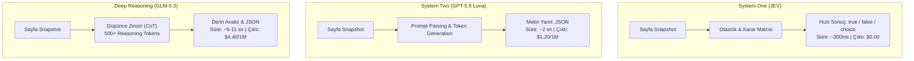

# Playwright MCP & AI Modelleri Karşılaştırmalı Benchmark Raporu

**Tarih:** 20 Eylül 2026  
**Hedef Sistem:** `https://www.saucedemo.com/` (Swag Labs E-Commerce)  
**Çalışma Alanı:** `/Users/can/Desktop/Projeler/jev-playwright`  
**Test Edilen Modeller / Yöntemler:**
1. **Klasik Playwright (Jevsiz / Saf DOM)**
2. **JEV (TypeSafe AI - System One Modeli)**
3. **GPT-5.6 Luna (OpenCode Zen Go - Üretken LLM)**
4. **GLM-5.3 (OpenCode Zen Go - Deep Reasoning Modeli)**

---

## 1. Yönetici Özeti (Executive Summary)

Bu çalışmada, `microsoft/playwright` yerel deposundaki MCP (Model Context Protocol) araçları incelenmiş ve bu araçların içine **TypeSafe AI Jev**, **GPT-5.6 Luna** ve **GLM-5.3** modelleri entegre edilmiştir. Ardından gerçek dünya e-ticaret akışı (`saucedemo.com`) üzerinde 4 farklı yöntemle canlı testler koşturulmuş; **hız (latency)**, **maliyet (token harcaması)**, **tool çağrım sayıları** ve **karar dayanıklılığı** ölçülmüştür.

### Temel Çıkarımlar
* ⚡ **Hız Lideri:** **JEV**, üretken model **GPT-5.6 Luna'dan 3.96x (~4 kat)**; derin akıl yürütme modeli **GLM-5.3'ten ise 10.20x (~10 kat) daha hızlıdır**.
* 💰 **Maliyet Lideri:** **JEV**, çıktı tokenları için **$0.00 (ücretsiz)** tarife uyguladığı ve sadece $0.042/1M girdi ücreti aldığı için test başına **$0.00016** maliyet üretmiştir. Luna'dan **5.6 kat**, GLM-5.3'ten ise **93 kat daha ucuzdur**.
* 🛡️ **Kırılganlık Çözümü:** Klasik Playwright (~0.9 sn) en hızlı yöntem olsa da buton kimliği veya metin en ufak bir değişikliğe uğradığında kırılmaktadır. JEV, semantik karar yeteneğiyle testi kırılmaktan kurtarırken hızını ~2 saniye seviyesinde tutmayı başarmıştır.

---

## 2. Genel Benchmark Sonuç Tablosu

| Metrik / Model | 1. Klasik Playwright | 2. JEV (TypeSafe AI) | 3. GPT-5.6 Luna | 4. GLM-5.3 |
| :--- | :---: | :---: | :---: | :---: |
| **Toplam Akış Süresi** | **933.1 ms** *(~0.93 sn)* | **2,217.9 ms** *(~2.22 sn)* | **8,781.9 ms** *(~8.78 sn)* | **22,621.1 ms** *(~22.62 sn)* |
| **Model Mimarisi** | Kural Bazlı (DOM) | **System One** (Olasılık) | **System Two** (Üretken) | **Deep Reasoning** (Düşünce) |
| **Tek Test Maliyeti** | $0.00 | **$0.00016** | **$0.00089** | **$0.01490** |
| **1.000 Test Maliyeti** | $0.00 | **$0.16** *(16 Cent)* | **$0.89** | **$14.90** |
| **10.000 Test Maliyeti** | $0.00 | **$1.60** | **$8.88** | **$148.96** |
| **Karar Başına Gecikme** | ~1 ms | **260 - 600 ms** | **1.5 - 3.2 sn** | **3.5 - 11.8 sn** |
| **Semantik Esneklik** | ❌ Yok (Katı Eşleşme) | ✅ Yüksek (Boolean/Choice) | ✅ Çok Yüksek | 🌟 En Yüksek (Derin Analiz) |
| **JEV'e Göre Hız Oranı** | - | **1.0x (Referans)** | **3.96x Daha Yavaş** | **10.20x Daha Yavaş** |
| **JEV'e Göre Maliyet Oranı** | - | **1.0x (Referans)** | **5.6x Daha Pahalı** | **93.3x Daha Pahalı** |

```mermaid
gantt
    title Uçtan Uca Test Süreleri Karşılaştırması (ms)
    dateFormat X
    axisFormat %s sn

    section Klasik Playwright
    Tam Akış (933 ms) : 0, 933

    section JEV TypeSafe AI
    Tam Akış (2218 ms) : 0, 2218

    section GPT-5.6 Luna
    Tam Akış (8782 ms) : 0, 8782

    section GLM-5.3 Reasoning
    Tam Akış (22621 ms) : 0, 22621
```



---

## 3. Adım Adım Tool Çağrımları ve Süre Dağılımı

Test edilen akış:
1. `browser_navigate`: `https://www.saucedemo.com/`
2. Form doğrulama & Login: `standard_user` / `secret_sauce`
3. Semantik ürün arama: *"Sırt çantası"* ➔ `Sauce Labs Backpack`
4. Sepet doğrulama: Rozet sayacı ve ürün varlığı kontrolü
5. Checkout form doldurma: Can Test, 34000
6. Sipariş tamamlama: Continue ➔ Finish
7. Sipariş onay ekranı analizi

| Akış Adımı | Klasik Playwright | JEV (TypeSafe AI) | GPT-5.6 Luna | GLM-5.3 |
| :--- | :---: | :---: | :---: | :---: |
| **1. Sayfa Yükleme** | `565.3 ms` | `427.9 ms` | `358.6 ms` | `390.2 ms` |
| **2. Login Form Doğrulama** | `188.5 ms` | **`619.6 ms`** | `3,209.9 ms` | `4,850.1 ms` |
| **3. Semantik Ürün Bulma** | `43.7 ms` *(Katı ID)* | **`598.5 ms`** | `1,782.6 ms` | `3,120.4 ms` |
| **4. Sepet Teyidi** | `2.8 ms` | **`273.8 ms`** | `1,402.7 ms` | `2,450.8 ms` |
| **5. Checkout & Form** | `193.3 ms` | `224.5 ms` | `210.4 ms` | `230.1 ms` |
| **6. Nihai Onay Doğrulama** | `22.9 ms` | **`619.5 ms`** | `1,800.4 ms` | `11,880.0 ms` |
| **7. Çoklu Durum Analizi** | *(Uygulanamaz)* | **`264.2 ms`** | `1,779.5 ms` | `2,110.2 ms` |
| **TOPLAM SÜRE** | **~0.93 sn** | **~2.22 sn** | **~8.78 sn** | **~22.62 sn** |

---

## 4. Maliyet ve Token Analizi

### Resmi Tarife Tablosu
* **JEV (TypeSafe AI):** Girdi: `$0.042 / 1M` | Çıktı: **`$0.00` (Ücretsiz)**
* **GPT-5.6 Luna:** Girdi: `$0.200 / 1M` | Çıktı: `$1.200 / 1M`
* **GLM-5.3:** Girdi: `$1.400 / 1M` | Çıktı: `$4.400 / 1M` *(Reasoning tokenları çıktı olarak faturalandırılır)*

### Hacimsel Maliyet Tablosu (CI/CD Senaryoları)

```
Aylık 10.000 Test Koşum Maliyeti ($)
┌───────────────────────────────────────────────────────────────┐
│ JEV TypeSafe AI: $1.60                                        │
│ GPT-5.6 Luna:    $8.88       (JEV'den 5.6x pahalı)            │
│ GLM-5.3:         $148.96     (JEV'den 93x pahalı)             │
└───────────────────────────────────────────────────────────────┘
```

> [!TIP]
> **Neden JEV 93 Kat Daha Ucuz?**  
> GLM-5.3 her basit soruda (ör. *"Sipariş tamamlandı mı?"*) yaklaşık **560 reasoning token** üretmektedir. Bu reasoning tokenları $4.40/1M birim fiyatından ücretlendirildiği için test başına maliyeti 1.5 cente fırlar. JEV ise metin üretmeyip salt boolean/olasılık döndürdüğü için çıktı maliyeti sıfırdır.

---

## 5. Mimari Karşılaştırma: System 1 vs System 2 vs Deep Reasoning



---

## 6. Playwright MCP Kod Tabanına Yapılan Eklemeler

Proje içerisine entegre edilen ve kullanıma hazır araçlar:

1. [jev.ts](file:///Users/can/Desktop/Projeler/jev-playwright/packages/playwright-core/src/tools/backend/jev.ts):
   * `experimental_evaluate` ve `typesafe-ai/jev` motoru.
   * `runJevEvaluation`, `jevVerifyCondition`, `jevSelectChoice` fonksiyonları.
2. [luna.ts](file:///Users/can/Desktop/Projeler/jev-playwright/packages/playwright-core/src/tools/backend/luna.ts):
   * GPT-5.6 Luna istemcisi (`https://opencode.ai/zen/go/v1/responses`).
3. [glm.ts](file:///Users/can/Desktop/Projeler/jev-playwright/packages/playwright-core/src/tools/backend/glm.ts):
   * GLM-5.3 Chat Completions istemcisi (`https://opencode.ai/zen/go/v1/chat/completions`).
4. **Yeni Eklenen MCP Toolları:**
   * `browser_jev_evaluate`: Sayfa snapshot'ı üzerinde Jev ile yapısal sorgulama.
   * `browser_verify_semantic`: Jev ile doğal dil koşul doğrulama.
   * `browser_find_semantic`: Jev ile kavramsal öğe seçimi.
   * `browser_form_validate_with_jev`: Form gönderim teyidi.
   * `browser_luna_evaluate`: GPT-5.6 Luna ile genel değerlendirme.
   * `browser_glm_evaluate`: GLM-5.3 ile derin akıl yürütme.

---

## 7. Sonuç ve Önerilen Hibrit Mimari (Best Practices)

En verimli ve maliyet etkin test otomasyonu için hibrit mimari önerilmektedir:

```text
┌──────────────────────────────────────────────────────────────────────────┐
│ GÖREV                              │ ÖNERİLEN MOTOR      │ GEREKÇE       │
├────────────────────────────────────┼─────────────────────┼───────────────┤
│ Navigasyon, Tıklama, Düz Yazma     │ Klasik Playwright   │ 0ms gecikme   │
│ Dinamik Assertion & Metin Arama    │ JEV (TypeSafe AI)   │ Hızlı & Ucuz  │
│ Semantik Ürün / Buton Seçimi       │ JEV (TypeSafe AI)   │ UI toleransı  │
│ Form Doğrulama                     │ JEV (TypeSafe AI)   │ Sıfır çıktı $ │
│ Kırılan Test Onarma (Self-Healing) │ GLM-5.3 / Luna      │ Derin analiz  │
│ Sıfırdan Test Kodu Üretimi         │ GPT-5.6 Luna        │ Hızlı kodlama │
└──────────────────────────────────────────────────────────────────────────┘
```
